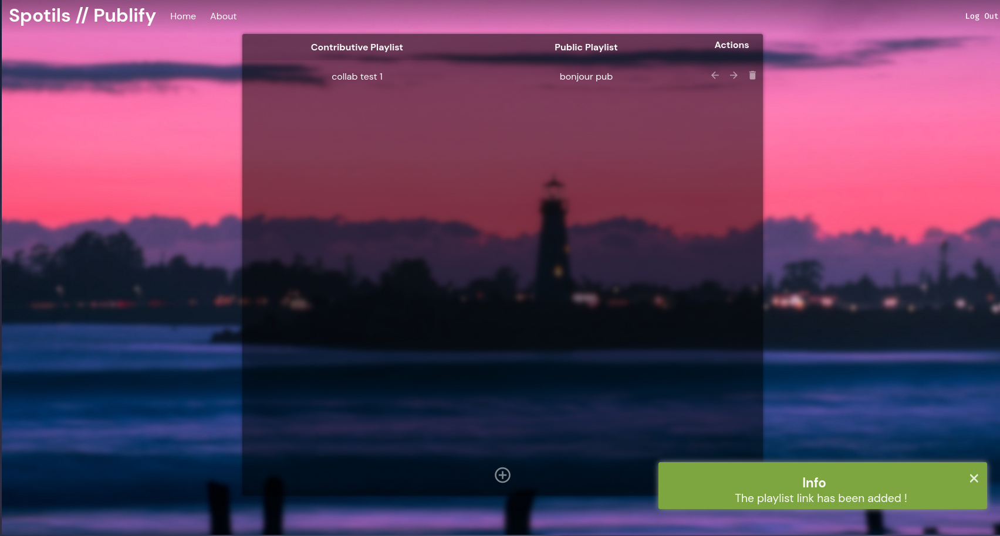
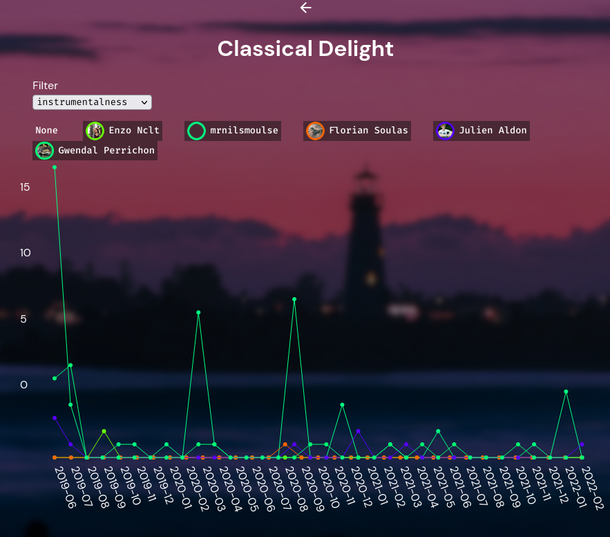
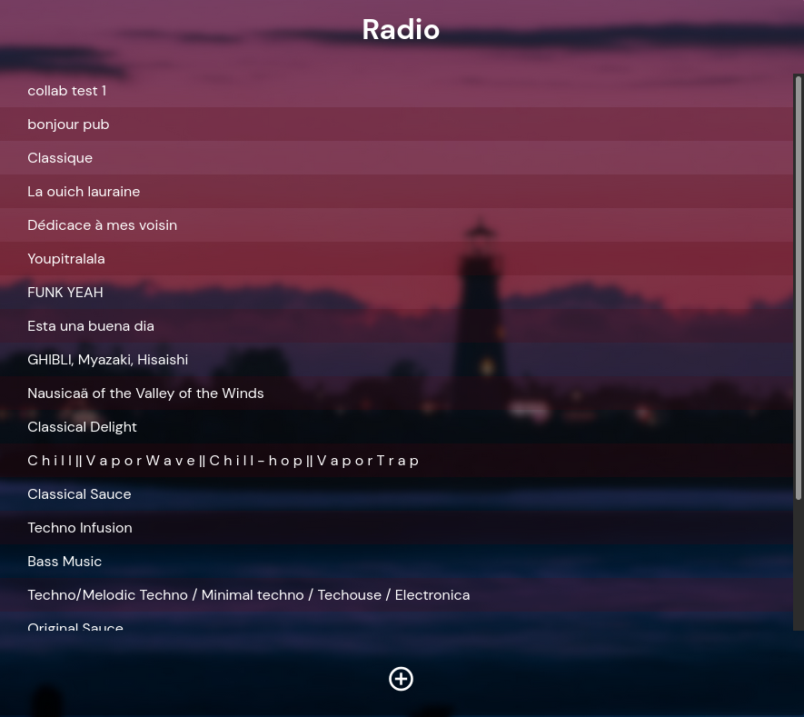

# Spotils
Management tools for spotify collaborative playlist and public playlists.

## Publify
This tool allow to *synchronize* **collaborative** playlists and **public** playlists, removing doubles.

This allow you and your friend to create collaborative playlists, share a public version of the playlist to strangers and use this tool to keep the public playlist updated with the collaborative one.



## Statify
This tool create **collaboration** statistics for a given collaborative playlist. It create a graph that shows playlist activity per user.



## Scanify
This tool create a **private** playlist with all the recents releases of the artists of a selected playlist.



# Spotils Back
Application made with Python with the FastAPI framework.
SQL database made with PostgreSQL.

## Dependencies
Dependencies are described in the [Pipfile](./spotils_back/Pipfile)

For local development use 
```sh
pipenv install
pipenv run uvicorn spotils_back:app --reload
```

[Folder](spotils_back)

## Environment variables
Multiples environment variables are required for this application to run.
### Secret Environment variables
- **SPOTIFY_CLIENT_ID** : Client ID delivered by Spotify developper dashboard.
- **SPOTIFY_CLIENT_SECRET** : Client SECRET delivered by Spotify developper dashboard.
- **DATABASE_URL** : Connection string for sqlalchemy.

### Public Environment variables
- **CALLBACK_URL** : URL Spotify redirects to after authentification.
- **REDIRECT_URL** : URL we redirect to after receiving a token.
- **CORS_ORIGIN** : Allowed origin for Cross Origin Resource Sharing.
- **APP_ENV** : Environment to choose before starting server.

If no **APP_ENV** is set the app start with a default configuration:
if you want to configure everything via your environment set this value to `env`
- **origin** : `localhost` or `localhost:8080`
- Sqlite database will be created
- **CALLBACK_URL** is set on `https://xxx.localhost/api/auth/authorized` this must match in your [spotify developper dashboard](https://developer.spotify.com/dashboard/login).
- **REDIRECT_URL** is set on `http://localhost:8080`

This is the minimal setup for local developpement.
```sh
export APP_ENV=""
export SPOTIFY_CLIENT_ID=<your-spotify-client-id>
export SPOTIFY_CLIENT_SECRET=<your-spotify-secret-id>

pipenv run uvicorn main:app --reload
```

## API Description
| rule  |      route            |   description                             |
--------|-----------------------|-------------------------------------------| 
|GET    | /playlist             | # Return a playlist list                  |
|GET    | /playlist/`<id>`      | # Return a playlist's link information    |
|GET    | /playlist/`<id>`/sync | # Return a synchronization status for playlist|
|PUT    | /playlist/`<id>`      | # Update a playlist link                  |
|PUT    | /playlist/`<id>`/sync | # Request synchronization of a playlist   |
|POST   | /playlist             | # Create a new playlist synchronization   |
|DELETE | /playlist/`<id>`      | # Remove a synchronization link           |
|GET    | /playlist-info/`<spotify_playlist_id>` | # Return a playlist informations|
|GET    | /auth/login           | # This link redirect to login with spotify|
|GET    | /auth/authorized      | # Callback url on which spotify redirects to after login|
|GET    | /auth/user            | # Return User informations                |
|GET    | /users/`<playlist_id>`| # Return User informations for the playlist|
|GET    | /playlist/`<playlist_id>`/graph| # Return playlist graph|
|POST    | /radio| # Create a radio playlist|

# Spotils Front
Application made with Preact microframework.
[Folder](spotils_front)

## Dependencies
All dependencies are described inside the [npm](./spotils_front/package.json) file

For local development, please use :
```sh
npm install
npm run dev
```

## Environment variables
- **SERVICE_URL** : Url of the spotils_back service.
- **COOKIE_DOMAIN** : Fully qualified domain name of the spotils_front app.

**REACT_APP_ENV** environment variable define which configuration will be used
if you want to config everything via your environment set this value to `env`
by default it fallback to `localhost` for **COOKIE_DOMAIN** and `localhost:8000` for **SERVICE_URL**
```sh
npm run dev
```
